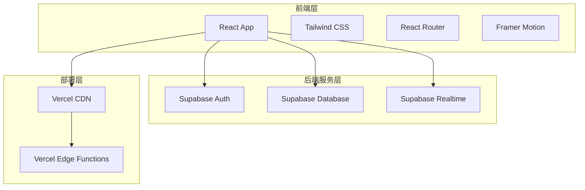
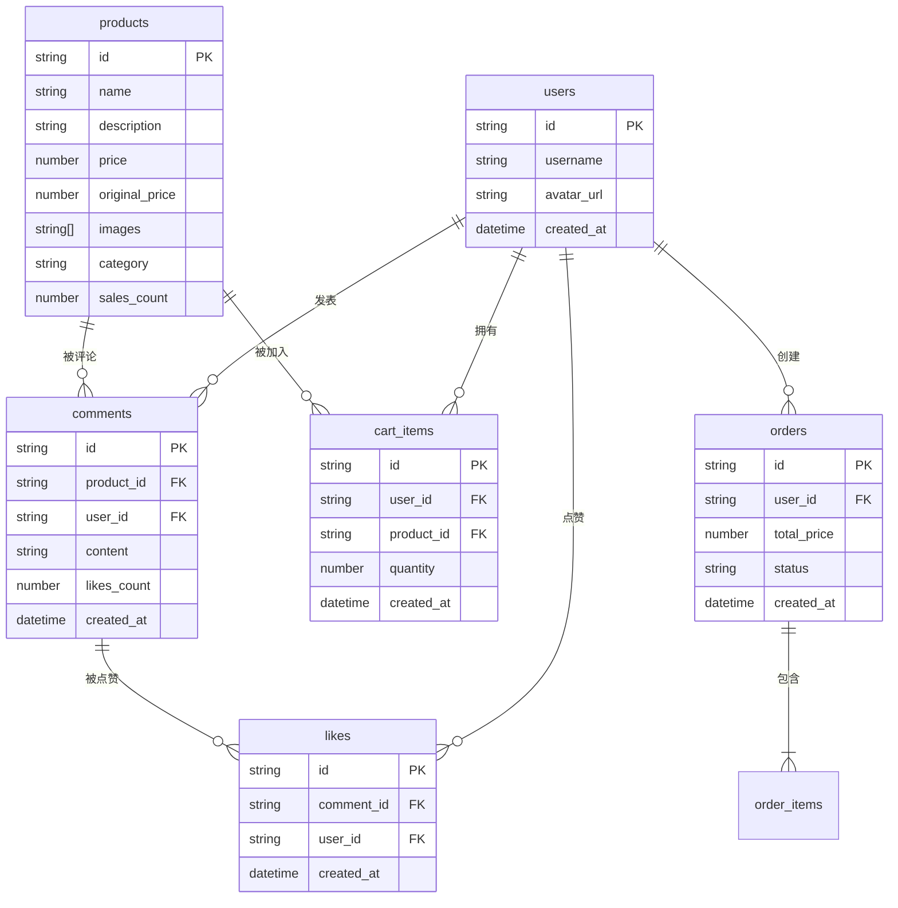

# 多巴胺购物平台 技术架构文档

## 1. 架构设计



## 2. 技术栈说明

### 2.1 前端技术

| 技术 | 版本 | 用途 |
|------|------|------|
| React | 18.x | 核心框架，组件化开发 |
| Tailwind CSS | 3.x | 样式系统，响应式设计 |
| Vite | 5.x | 构建工具，快速开发 |
| React Router | 6.x | 路由管理，页面导航 |
| Framer Motion | 11.x | 动画库，流畅动效 |
| Zustand | 4.x | 状态管理，轻量级 |
| Supabase Client | 2.x | 后端SDK，数据交互 |

### 2.2 后端服务

| 服务 | 用途 |
|------|------|
| Supabase Auth | 用户认证、邮箱登录 |
| Supabase Database | PostgreSQL数据库，存储商品、评论、订单 |
| Supabase Realtime | 实时评论更新、点赞同步 |

### 2.3 部署方案

| 平台 | 用途 |
|------|------|
| Vercel | 前端托管、自动部署、CDN加速 |
| Supabase | 后端托管、数据库托管（免费额度） |

## 3. 路由定义

| 路由路径 | 页面名称 | 功能描述 |
|----------|----------|----------|
| `/` | 首页 | 商品分类、推荐商品、搜索入口 |
| `/category/:id` | 商品列表页 | 分类商品展示、筛选排序 |
| `/product/:id` | 商品详情页 | 商品信息、评论互动 |
| `/cart` | 购物车页 | 购物车管理、结算入口 |
| `/checkout` | 结算页 | 模拟支付流程 |
| `/success` | 支付成功页 | 动画庆祝、订单确认 |
| `/orders` | 订单列表页 | 订单历史查看 |
| `/order/:id` | 订单详情页 | 单个订单详情 |
| `/login` | 登录页 | 用户登录 |
| `/register` | 注册页 | 用户注册 |
| `/profile` | 用户中心 | 个人信息管理 |

## 4. API定义

### 4.1 Supabase表结构

#### 用户表 (users - 由Supabase Auth管理)

```typescript
// Supabase auth.users 表扩展
interface UserProfile {
  id: string;           // UUID，关联auth.users
  username: string;     // 用户名
  avatar_url: string;   // 头像URL
  created_at: Date;     // 注册时间
}
```

#### 商品表 (products)

```typescript
interface Product {
  id: string;           // UUID
  name: string;         // 商品名称
  description: string;  // 商品描述
  price: number;        // 当前价格
  original_price: number; // 原价
  images: string[];     // 图片URL数组
  category: string;     // 分类ID
  sub_category: string; // 子分类
  sales_count: number;  // 销量
  specs: SpecOption[];  // 规格选项
  created_at: Date;     // 创建时间
}

interface SpecOption {
  name: string;         // 规格名称（如颜色、尺寸）
  values: string[];     // 规格值数组
}
```

#### 评论表 (comments)

```typescript
interface Comment {
  id: string;           // UUID
  product_id: string;   // 商品ID
  user_id: string;      // 用户ID
  content: string;      // 评论内容
  likes_count: number;  // 点赞数
  created_at: Date;     // 评论时间
}
```

#### 点赞表 (likes)

```typescript
interface Like {
  id: string;           // UUID
  comment_id: string;   // 评论ID
  user_id: string;      // 用户ID
  created_at: Date;     // 点赞时间
}
```

#### 购物车表 (cart_items)

```typescript
interface CartItem {
  id: string;           // UUID
  user_id: string;      // 用户ID
  product_id: string;   // 商品ID
  quantity: number;     // 数量
  selected_spec: Record<string, string>; // 选中的规格
  created_at: Date;     // 加入时间
}
```

#### 订单表 (orders)

```typescript
interface Order {
  id: string;           // UUID
  user_id: string;      // 用户ID
  items: OrderItem[];   // 订单商品
  total_price: number;  // 总价
  status: OrderStatus;  // 订单状态
  created_at: Date;     // 创建时间
}

interface OrderItem {
  product_id: string;   // 商品ID
  product_name: string; // 商品名称（快照）
  price: number;        // 价格（快照）
  quantity: number;     // 数量
  image: string;        // 图片（快照）
}

enum OrderStatus {
  'pending' = '待发货',
  'shipped' = '已发货',
  'delivered' = '已送达',
  'completed' = '已完成'
}
```

### 4.2 API接口定义

#### 商品相关

```typescript
// 获取商品列表
GET /products
Query: { category?: string, sort?: 'price' | 'sales', page?: number }
Response: { products: Product[], total: number }

// 获取商品详情
GET /products/:id
Response: Product

// 搜索商品
GET /products/search
Query: { keyword: string }
Response: { products: Product[] }
```

#### 评论相关

```typescript
// 获取商品评论
GET /comments
Query: { product_id: string, sort?: 'time' | 'likes' }
Response: { comments: Comment[] }

// 发表评论
POST /comments
Body: { product_id: string, content: string }
Response: Comment

// 点赞评论
POST /likes
Body: { comment_id: string }
Response: { success: boolean }

// 取消点赞
DELETE /likes/:id
Response: { success: boolean }
```

#### 购物车相关

```typescript
// 获取购物车
GET /cart
Query: { user_id: string }
Response: { items: CartItem[] }

// 加入购物车
POST /cart
Body: { product_id: string, quantity: number, spec?: object }
Response: CartItem

// 更新数量
PUT /cart/:id
Body: { quantity: number }
Response: CartItem

// 删除商品
DELETE /cart/:id
Response: { success: boolean }
```

#### 订单相关

```typescript
// 创建订单
POST /orders
Body: { items: CartItem[] }
Response: Order

// 获取订单列表
GET /orders
Query: { user_id: string }
Response: { orders: Order[] }

// 获取订单详情
GET /orders/:id
Response: Order
```

## 5. 数据模型ER图



## 6. 数据库DDL

```sql
-- 用户资料表（扩展Supabase auth.users）
CREATE TABLE user_profiles (
    id UUID REFERENCES auth.users(id) PRIMARY KEY,
    username VARCHAR(50) NOT NULL,
    avatar_url TEXT,
    created_at TIMESTAMP WITH TIME ZONE DEFAULT NOW()
);

-- 商品表
CREATE TABLE products (
    id UUID DEFAULT gen_random_uuid() PRIMARY KEY,
    name VARCHAR(200) NOT NULL,
    description TEXT,
    price DECIMAL(10,2) NOT NULL,
    original_price DECIMAL(10,2),
    images TEXT[] NOT NULL,
    category VARCHAR(50) NOT NULL,
    sub_category VARCHAR(50),
    sales_count INTEGER DEFAULT 0,
    specs JSONB DEFAULT '{}',
    created_at TIMESTAMP WITH TIME ZONE DEFAULT NOW()
);

-- 评论表
CREATE TABLE comments (
    id UUID DEFAULT gen_random_uuid() PRIMARY KEY,
    product_id UUID REFERENCES products(id) NOT NULL,
    user_id UUID REFERENCES auth.users(id) NOT NULL,
    content TEXT NOT NULL,
    likes_count INTEGER DEFAULT 0,
    created_at TIMESTAMP WITH TIME ZONE DEFAULT NOW()
);

-- 点赞表
CREATE TABLE likes (
    id UUID DEFAULT gen_random_uuid() PRIMARY KEY,
    comment_id UUID REFERENCES comments(id) NOT NULL,
    user_id UUID REFERENCES auth.users(id) NOT NULL,
    created_at TIMESTAMP WITH TIME ZONE DEFAULT NOW(),
    UNIQUE(comment_id, user_id)
);

-- 购物车表
CREATE TABLE cart_items (
    id UUID DEFAULT gen_random_uuid() PRIMARY KEY,
    user_id UUID REFERENCES auth.users(id) NOT NULL,
    product_id UUID REFERENCES products(id) NOT NULL,
    quantity INTEGER DEFAULT 1,
    selected_spec JSONB DEFAULT '{}',
    created_at TIMESTAMP WITH TIME ZONE DEFAULT NOW()
);

-- 订单表
CREATE TABLE orders (
    id UUID DEFAULT gen_random_uuid() PRIMARY KEY,
    user_id UUID REFERENCES auth.users(id) NOT NULL,
    items JSONB NOT NULL,
    total_price DECIMAL(10,2) NOT NULL,
    status VARCHAR(20) DEFAULT 'pending',
    created_at TIMESTAMP WITH TIME ZONE DEFAULT NOW()
);

-- 创建索引
CREATE INDEX idx_products_category ON products(category);
CREATE INDEX idx_comments_product ON comments(product_id);
CREATE INDEX idx_comments_user ON comments(user_id);
CREATE INDEX idx_likes_comment ON likes(comment_id);
CREATE INDEX idx_cart_user ON cart_items(user_id);
CREATE INDEX idx_orders_user ON orders(user_id);

-- 实时订阅配置（Supabase Realtime）
ALTER publication supabase_realtime ADD TABLE comments;
ALTER publication supabase_realtime ADD TABLE likes;
```

## 7. 前端状态管理

### 7.1 全局状态 (Zustand)

```typescript
// stores/useUserStore.ts
interface UserState {
  user: UserProfile | null;
  isLoggedIn: boolean;
  login: (email: string, password: string) => Promise<void>;
  logout: () => void;
}

// stores/useCartStore.ts
interface CartState {
  items: CartItem[];
  addItem: (product: Product, quantity: number) => void;
  removeItem: (id: string) => void;
  updateQuantity: (id: string, quantity: number) => void;
  clearCart: () => void;
  getTotal: () => number;
}

// stores/useProductStore.ts
interface ProductState {
  products: Product[];
  currentProduct: Product | null;
  searchResults: Product[];
  fetchProducts: (category?: string) => Promise<void>;
  searchProducts: (keyword: string) => Promise<void>;
}
```

## 8. 项目目录结构

```
dopamine-shop/
├── src/
│   ├── components/
│   │   ├── common/
│   │   │   ├── Navbar.tsx
│   │   │   ├── Footer.tsx
│   │   │   ├── ProductCard.tsx
│   │   │   ├── LoadingSpinner.tsx
│   │   │   └── SearchBar.tsx
│   │   ├── home/
│   │   │   ├── HeroBanner.tsx
│   │   │   ├── CategorySection.tsx
│   │   │   └── FeaturedProducts.tsx
│   │   ├── product/
│   │   │   ├── ProductGallery.tsx
│   │   │   ├── ProductInfo.tsx
│   │   │   ├── SpecSelector.tsx
│   │   │   └── CommentSection.tsx
│   │   ├── cart/
│   │   │   ├── CartItem.tsx
│   │   │   ├── CartSummary.tsx
│   │   │   └── EmptyCart.tsx
│   │   ├── checkout/
│   │   │   ├── CheckoutForm.tsx
│   │   │   └── SuccessAnimation.tsx
│   │   └── user/
│   │       ├── LoginForm.tsx
│   │       ├── RegisterForm.tsx
│   │       └── ProfileCard.tsx
│   ├── pages/
│   │   ├── HomePage.tsx
│   │   ├── CategoryPage.tsx
│   │   ├── ProductPage.tsx
│   │   ├── CartPage.tsx
│   │   ├── CheckoutPage.tsx
│   │   ├── SuccessPage.tsx
│   │   ├── OrdersPage.tsx
│   │   ├── LoginPage.tsx
│   │   ├── RegisterPage.tsx
│   │   └── ProfilePage.tsx
│   ├── stores/
│   │   ├── useUserStore.ts
│   │   ├── useCartStore.ts
│   │   └── useProductStore.ts
│   ├── hooks/
│   │   ├── useSupabase.ts
│   │   ├── useCart.ts
│   │   ├── useComments.ts
│   │   └── useRealtime.ts
│   ├── lib/
│   │   ├── supabase.ts
│   │   └── utils.ts
│   ├── data/
│   │   ├── products.ts
│   │   ├── categories.ts
│   │   └── mockData.ts
│   ├── styles/
│   │   └── globals.css
│   ├── App.tsx
│   └── main.tsx
├── public/
│   ├── favicon.ico
│   └── images/
├── .env.local
├── package.json
├── tailwind.config.js
├── vite.config.ts
└── tsconfig.json
```

## 9. 开发计划

### 9.1 第一阶段：基础框架
- 项目初始化
- 路由配置
- 基础组件开发
- Supabase配置

### 9.2 第二阶段：核心功能
- 商品展示
- 购物车功能
- 模拟下单流程
- 支付成功动画

### 9.3 第三阶段：用户系统
- 用户注册登录
- 评论系统
- 点赞功能
- 实时更新

### 9.4 第四阶段：优化部署
- 响应式优化
- 性能优化
- Vercel部署
- 测试上线